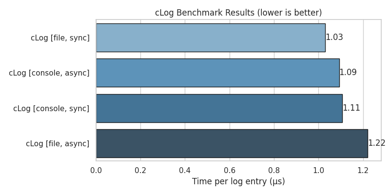

# cLog++

[](https://github.com/mbn-code/cLogpp/actions)
[](LICENSE)
[](https://github.com/mbn-code/cLogpp/stargazers)
[](https://en.cppreference.com/w/cpp/17)
[](https://github.com/mbn-code/cLogpp)

**Zero-dependency, header-only structured logging for modern C++.**

> Async by default. Chainable API. JSON structured output. No macros.
> cLog++ is a small, single-namespace logger for developers who want structured,
> thread-safe logging without pulling in external dependencies or a heavy build.

---

## Why cLog++?

- **Zero dependencies:** no `nlohmann/json`, no Boost, no external runtime. Drop `include/` into your project.
- **Header-only:** include the headers and compile; nothing to link beyond the standard library and threads.
- **Structured JSON:** every line carries a UTC `ts`, a `level`, an `event`, and your fields. Numbers and booleans are emitted as native JSON values, ready for ELK, Splunk, or `jq`.
- **Chainable API:** `log.info("user.login").kv("id", 42).kv("ok", true);` — no macros.
- **Lossless async:** the background worker drains a bounded queue; when the queue is full the producer waits (backpressure) instead of dropping logs.
- **Thread-safe:** multiple threads may log on the same `Logger` concurrently; each log statement builds its own record.

---

## Quick Start

### 1. Integrate
Copy the `include/` directory into your project, or add cLog++ with CMake:

```cmake
add_subdirectory(cLogpp)          # or FetchContent
target_link_libraries(your_app PRIVATE clogpp::clogpp)
```

### 2. Use
```cpp
#include "logger.hpp"

int main() {
    c_log::Logger log;            // async by default; console sink writes to stderr

    log.info("server.start")
       .kv("port", 8080)
       .kv("env", "production")
       .kv("workers", 4);

    log.error("db.connection_failed")
       .kv("code", 503)
       .kv("retrying", true);

    // The Logger flushes and joins its worker when it goes out of scope.
}
```

Output (one JSON object per line):

```json
{"ts":"2026-06-08T21:04:05.123Z","level":"info","event":"server.start","port":8080,"env":"production","workers":4}
{"ts":"2026-06-08T21:04:05.123Z","level":"error","event":"db.connection_failed","code":503,"retrying":true}
```

### 3. Build (without CMake)
```bash
g++ -std=c++17 -O2 -I./include main.cpp -o app -pthread
./app
```

> [!IMPORTANT]
> Keep the `Logger` alive for as long as you log through it. It owns a background
> worker thread and flushes all pending entries when it is destroyed. Do not let a
> `LogRecord` (the object returned by `log.info(...)`) outlive its `Logger`.

---

## Output format

Each entry is a single-line JSON object with a fixed prefix followed by your fields:

| Field     | Type   | Notes                                         |
|-----------|--------|-----------------------------------------------|
| `ts`      | string | ISO-8601 UTC, millisecond precision           |
| `level`   | string | `trace` / `debug` / `info` / `warning` / `error` / `critical` |
| `event`   | string | the event name you passed                     |
| your keys | mixed  | strings are quoted+escaped; ints, floats and bools are native JSON |

---

## Benchmarks

The repository includes a micro-benchmark (`benchmarks/benchmark_logger.cpp`). It
times 100,000 end-to-end log calls **including the full async drain**, so the async
numbers reflect real delivery (async mode is lossless), not dropped entries.

Measured on the author's machine (AMD Ryzen 7 9800X3D, Windows 11, g++ 15.2 `-O3`,
single producer thread):

| Sink            | Mode  | Time per log (μs) |
|-----------------|-------|-------------------|
| null (discard)  | sync  | ~0.19             |
| file            | sync  | ~0.33             |
| null (discard)  | async | ~0.47             |
| file            | async | ~0.60             |



> [!NOTE]
> These are single-producer, end-to-end numbers. Async mode is **not** about higher
> total throughput here — the single background worker does all the serialization and
> I/O while the producer waits, so end-to-end it costs a little more than sync. What
> async buys you is keeping serialization and I/O **off your calling thread** (lower,
> more predictable hot-path latency) while guaranteeing no log is dropped. For raw
> end-to-end throughput on one thread, sync is simplest and fastest. Run the benchmark
> on your own hardware — your numbers will differ.

To reproduce:

```bash
cmake -S . -B build -DCLOGPP_BUILD_BENCHMARKS=ON && cmake --build build
./build/benchmark_logger          # writes benchmark_results.csv
python benchmarks/plot_benchmarks.py   # writes benchmark.png (needs matplotlib)
```

---

## Features

- **Async & sync modes:** choose with `Logger::Mode`. Async offloads work to a background worker; sync emits inline.
- **Lossless async:** a bounded queue with backpressure — full queue blocks the producer instead of dropping entries. Capacity is configurable: `Logger(Mode::Async, capacity)`.
- **Level filtering:** `set_level(Level::Warning)` skips everything below `warning`; `Level::None` silences all output.
- **Native-typed fields:** `kv` overloads for `std::string`, `const char*`, `bool`, integers (signed/unsigned, up to 64-bit), and `double`.
- **Sinks:** built-in `ConsoleSink` (stderr), `FileSink`, and size-based `RotatingFileSink`. Add your own by implementing `c_log::Sink`.
- **Explicit flush:** `log.flush()` blocks until everything submitted so far has been written, then flushes the sinks.

---

## Threading model

cLog++ is safe to use from multiple threads:

- Several threads may call `log.info(...).kv(...)` on the **same** `Logger` at the same time. Each statement builds its own `LogRecord`, so there is no shared per-entry state to corrupt.
- The async queue is guarded by a mutex (it is a multi-producer / single-consumer queue), and sink writes are serialized, so entries are never interleaved or torn.

> The bundled `spsc_ring_buffer.hpp` is a lock-free single-producer/single-consumer
> primitive. The `Logger` wraps it in a mutex to make it multi-producer-safe, so the
> async path is mutex-synchronized, not lock-free.

---

## Advanced Usage

<details>
<summary><strong>Custom sinks</strong></summary>

Route logs anywhere (network, database, custom format) by implementing `Sink`:

```cpp
struct NetworkSink : c_log::Sink {
    void log(const std::string& msg) override { /* send msg to a remote server */ }
    void flush() override { /* optional: flush buffered output */ }
};

log.add_sink(std::make_unique<NetworkSink>());
```

Use `log.clear_sinks()` first if you want to drop the default console sink.
</details>

<details>
<summary><strong>Filtering levels</strong></summary>

```cpp
log.set_level(c_log::Level::Warning); // ignore trace/debug/info
log.warn("system.low_memory");        // logged
log.info("system.heartbeat");         // ignored
```
</details>

<details>
<summary><strong>Rotating file sink</strong></summary>

```cpp
#include "rotating_file_sink.hpp"

// Rotate at ~10 MB, keep 5 backups: app.log -> app.log.1 -> ... -> app.log.5
log.clear_sinks();
log.add_sink(std::make_unique<c_log::RotatingFileSink>("app.log", 10 * 1024 * 1024, 5));
```
</details>

<details>
<summary><strong>Flushing before a checkpoint</strong></summary>

```cpp
log.error("payment.failed").kv("order", 1234);
log.flush(); // block until written, e.g. before exiting or after a critical event
```
</details>

---

## Contributing

Contributions are welcome — bug reports, features, and code.

1. Check the [Issues](https://github.com/mbn-code/cLogpp/issues).
2. Read the [Contributing Guide](CONTRIBUTING.md).
3. Open a Pull Request.

**Roadmap:**
- [x] Lossless async log draining (backpressure)
- [x] Zero-dependency JSON serializer with timestamp + level + native types
- [x] Console, file, and rotating-file sinks
- [x] Working level filtering
- [x] CMake build and CI tests on Linux, macOS, and Windows
- [ ] Per-sink level thresholds
- [ ] Optional source-location fields (file/line/function)

---

## License

MIT © [cLog++ Contributors](LICENSE).

---

> If you find cLog++ useful, consider starring the repository on GitHub.

<details>
<summary><strong>Note on AI involvement</strong></summary>

Some portions of this project were implemented with the aid of AI tooling. As a
result, some aspects of the code and design may differ from conventionally developed
open-source projects. Reviews, suggestions, and contributions are very welcome.

</details>
